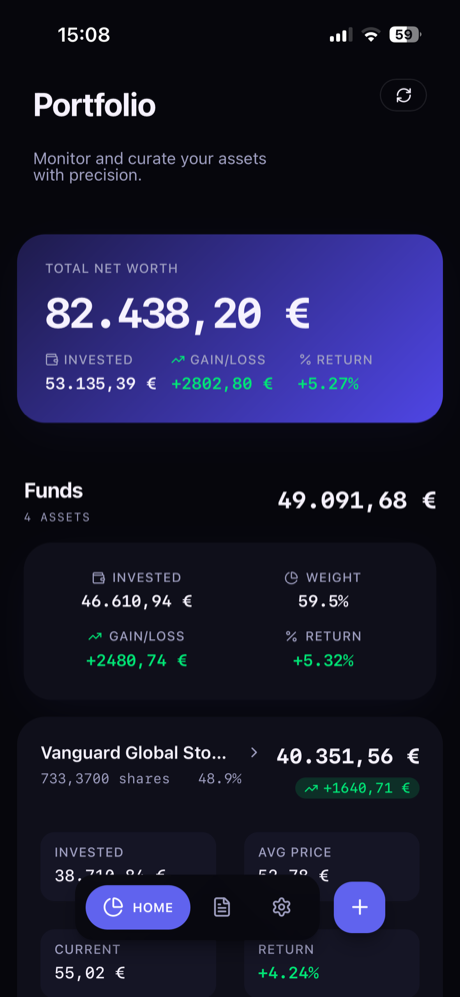
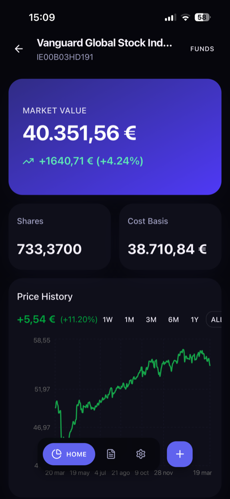
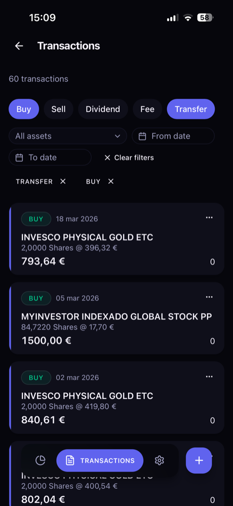
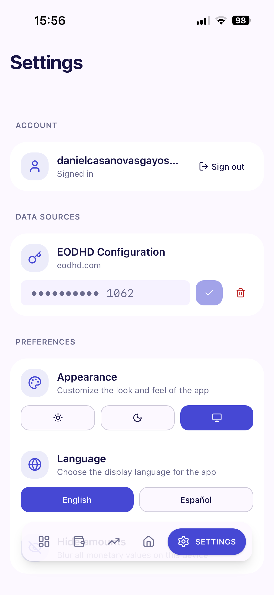

# Portfolio Tracker

A personal investment portfolio tracker built with Next.js. Track holdings, transactions, and performance across funds, stocks, and pension plans with real-time pricing and automated email import.

<table>
  <tr>
    <td align="center"><br /><em>Portfolio</em></td>
    <td align="center"><br /><em>Asset Detail</em></td>
    <td align="center"><br /><em>Transactions</em></td>
    <td align="center"><br /><em>Settings</em></td>
  </tr>
</table>

## Features

- **Portfolio dashboard** — Total net worth, category breakdown (Funds, Stocks, Pension Plans), per-asset gain/loss and weight
- **Asset detail view** — Market value, shares, cost basis, and interactive price history chart with 1W/1M/3M/6M/1Y/ALL timeframes
- **Transaction management** — Full CRUD with filtering by type (Buy, Sell, Dividend, Fee, Transfer), asset, and date range
- **FIFO cost accounting** — Automatic cost basis calculation using first-in, first-out method
- **Real-time prices** — EODHD API integration with smart caching (shorter TTL during trading hours)
- **Gmail import** — Automatically parse and import MyInvestor transaction emails via OAuth
- **Multi-currency** — EUR-based with configurable default currency
- **i18n** — English and Spanish
- **Mobile-first PWA** — Bottom navigation, safe area support, offline-ready with service worker
- **Dark mode** — System, light, and dark themes

## Tech Stack

| Layer | Technology |
|-------|------------|
| Framework | Next.js 16 (App Router, Server Components) |
| Language | TypeScript (strict) |
| Database | PostgreSQL (Supabase) + Prisma ORM |
| Auth | Supabase Auth |
| Styling | Tailwind CSS 4 + shadcn/ui |
| Charts | Recharts |
| Deployment | Vercel |

## Getting Started

### Prerequisites

- Node.js 20+
- PostgreSQL database (or a [Supabase](https://supabase.com) project)
- [EODHD API](https://eodhd.com) key (for market prices)

### Environment Variables

Create a `.env` file in the project root:

```env
DATABASE_URL=           # Supabase pooler connection string
DIRECT_URL=             # Supabase direct connection string (for migrations)

NEXT_PUBLIC_SUPABASE_URL=
NEXT_PUBLIC_SUPABASE_ANON_KEY=

GOOGLE_CLIENT_ID=       # For Gmail import
GOOGLE_CLIENT_SECRET=
GOOGLE_REDIRECT_URI=

CRON_SECRET=            # Protects the price update cron endpoint
EODHD_API_KEY=          # Market data API
```

### Setup

```bash
npm install
npx prisma migrate dev   # Run database migrations
npm run db:seed           # Seed reference data
npm run dev               # Start dev server at http://localhost:3000
```

### Scripts

| Command | Description |
|---------|-------------|
| `npm run dev` | Start development server |
| `npm run build` | Generate Prisma client + build for production |
| `npm start` | Start production server |
| `npm run lint` | Run ESLint |
| `npm run db:migrate` | Run Prisma migrations |
| `npm run db:studio` | Open Prisma Studio |
| `npm run db:seed` | Seed database with reference data |

## Architecture

```
src/
├── actions/        # Server Actions (data mutations + validation)
├── app/            # App Router pages and layouts
│   ├── (auth)/     # Login/register (public)
│   ├── (main)/     # Authenticated pages (portfolio, transactions, settings)
│   └── api/        # REST endpoints (OAuth callbacks, cron, prices)
├── components/     # React components (shadcn/ui based)
├── i18n/           # next-intl config + message files (en/es)
├── lib/            # Shared utilities (auth, DB client, validators, email parsing)
├── services/       # Domain logic (holdings FIFO, price fetching, email parsing)
└── types/          # Shared TypeScript types
```

**Data flow:** Client → Server Action → Service → Prisma → PostgreSQL. Server Actions return `ActionResult<T>` (success/error union) and call `revalidatePath()` on mutations.

## Deployment

Deployed on Vercel with a cron job that updates prices for all users' holdings on weekdays at 6 PM CET (`0 18 * * 1-5`).

## License

Private project.
