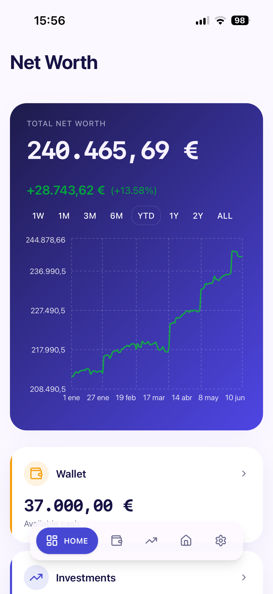
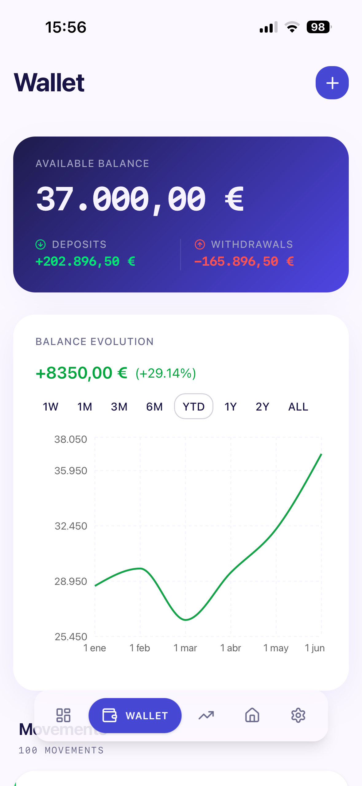
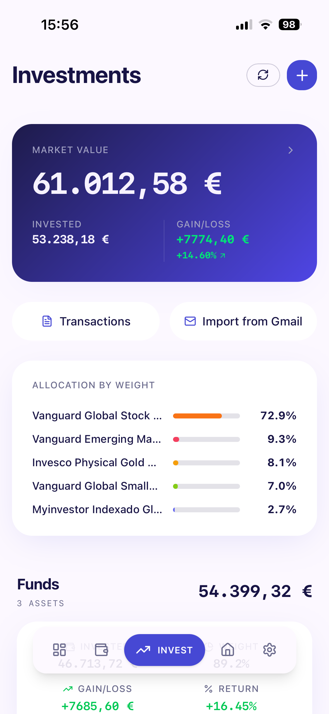
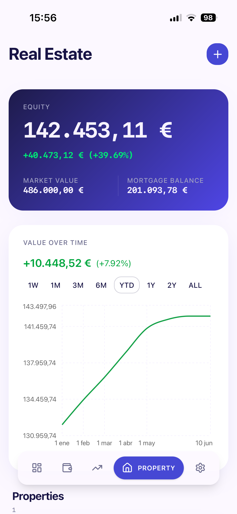

<div align="center">


# Portfolio Tracker

A personal net-worth tracker built with Next.js, organized in **three isolated data domains** — Wallet (cash), Investments (funds, ETFs, stocks, pension plans) and Real Estate — aggregated read-only on a single dashboard. Real-time pricing, mortgage amortization and automated email import.

</div>

<table>
  <tr>
    <td align="center"><br /><em>Dashboard</em></td>
    <td align="center"><br /><em>Wallet</em></td>
    <td align="center"><br /><em>Investments</em></td>
    <td align="center"><br /><em>Real Estate</em></td>
    <td align="center"><br /><em>Settings</em></td>
  </tr>
</table>

## Features

- **Dashboard** — Total net worth aggregated read-only across the three domains, with a combined evolution chart and per-domain breakdown
- **Wallet** — Cash deposits and withdrawals as a standalone domain: available balance, balance evolution and movement history
- **Investments** — Holdings grouped by asset class (Funds, ETFs, Stocks, Pension Plans), per-asset gain/loss and weight, FIFO cost accounting
- **Asset detail view** — Market value, shares, cost basis, asset-class reclassification, and interactive price history chart
- **Transaction management** — Full CRUD with filtering by type (Buy, Sell, Transfer In/Out, Dividend, Fee), asset, and date range
- **Real estate** — Properties with manual valuations, ownership splits and French-system mortgage amortization (incl. partial repayments)
- **Real-time prices** — EODHD API integration with smart caching (shorter TTL during trading hours)
- **Gmail import** — Automatically parse and import MyInvestor transaction emails via OAuth
- **i18n** — English and Spanish
- **Mobile-first PWA** — Bottom navigation, safe area support, offline-ready with service worker
- **Dark mode** — System, light, and dark themes

## Tech Stack

| Layer | Technology |
|-------|------------|
| Framework | Next.js 16 (App Router, Server Components) |
| Language | TypeScript (strict) |
| Database | PostgreSQL (Supabase) + Prisma ORM |
| Auth | Supabase Auth |
| Styling | Tailwind CSS 4 + shadcn/ui |
| Charts | Recharts |
| Deployment | Vercel |

## Getting Started

### Prerequisites

- Node.js 20+
- PostgreSQL database (or a [Supabase](https://supabase.com) project)
- [EODHD API](https://eodhd.com) key (for market prices)

### Environment Variables

Create a `.env` file in the project root:

```env
DATABASE_URL=           # Supabase pooler connection string
DIRECT_URL=             # Supabase direct connection string (for migrations)

NEXT_PUBLIC_SUPABASE_URL=
NEXT_PUBLIC_SUPABASE_ANON_KEY=

GOOGLE_CLIENT_ID=       # For Gmail import
GOOGLE_CLIENT_SECRET=
GOOGLE_REDIRECT_URI=

CRON_SECRET=            # Protects the price update cron endpoint
EODHD_API_KEY=          # Market data API
```

### Setup

```bash
npm install
npx prisma migrate dev   # Run database migrations
npm run db:seed           # Seed reference data
npm run dev               # Start dev server at http://localhost:3000
```

### Scripts

| Command | Description |
|---------|-------------|
| `npm run dev` | Start development server |
| `npm run build` | Generate Prisma client + build for production |
| `npm start` | Start production server |
| `npm run lint` | Run ESLint |
| `npm run db:migrate` | Run Prisma migrations |
| `npm run db:studio` | Open Prisma Studio |
| `npm run db:seed` | Seed database with reference data |

## Architecture

Three isolated data domains that never share entities or reference each other; the dashboard is the only cross-domain surface, and it is read-only.

```
src/
├── actions/        # Server Actions per domain (wallet, transactions, real-estate, ...)
├── app/            # App Router pages and layouts
│   ├── (auth)/     # Login/register (public)
│   ├── (main)/     # Tabs: / (dashboard), /wallet, /investments, /real-estate, /settings
│   └── api/        # REST endpoints (OAuth callbacks, cron, prices)
├── components/     # React components (shadcn/ui based), grouped per domain
├── i18n/           # next-intl config + message files (en/es)
├── lib/            # Shared utilities (auth, DB client, validators, series math)
├── services/       # Domain logic (wallet, holdings FIFO, prices, real estate, dashboard)
└── types/          # Shared TypeScript types
```

**Data flow:** Client → Server Action → Service → Prisma → PostgreSQL. Server Actions return `ActionResult<T>` (success/error union) and call `revalidatePath()` on mutations.

## Deployment

Deployed on Vercel with a cron job that updates prices for all users' holdings on weekdays at 6 PM CET (`0 18 * * 1-5`).

## License

Private project.
